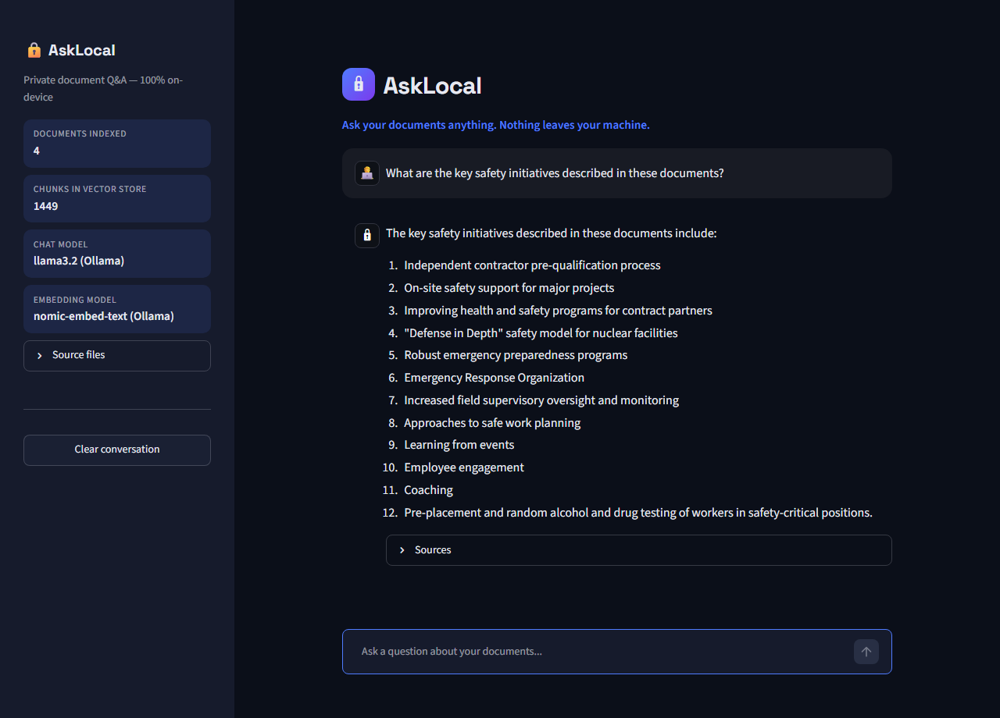

# 🔒 AskLocal

**A fully local, privacy-preserving RAG chatbot. Ask questions about your own documents without a single byte leaving your machine.**




## Why local?

Organizations that handle sensitive or confidential documents, such as healthcare records, financial filings, legal contracts, or internal engineering and safety procedures, often can't send that data to public cloud AI APIs due to privacy, compliance, or security requirements. AskLocal proves that a genuinely useful document Q&A assistant doesn't need the cloud: ingestion, embedding, retrieval, and generation all run on-device, with zero external API calls.

## Features

- **Drop-in PDF ingestion**: point it at any folder of PDFs and it builds a searchable knowledge base
- **Grounded answers, not guesses**: retrieved passages are handed to the model as context, and it's explicitly instructed to say "I don't know" rather than hallucinate
- **Source citations**: every answer links back to the exact file and page it came from
- **Live index stats**: sidebar shows how many documents and chunks are indexed, and which models are running
- **Zero network calls at inference time**: embeddings and generation both run through a local Ollama instance

## How it works

1. **Ingestion** ([ingest.py](ingest.py)): PDFs are loaded, split into overlapping text chunks, embedded locally with `nomic-embed-text` (via [Ollama](https://ollama.com)), and stored in a local [Chroma](https://www.trychroma.com/) vector database.
2. **Retrieval + generation** ([app.py](app.py)): a question is embedded the same way, the most similar chunks are pulled from Chroma, and those chunks are passed as context to a local LLM (`llama3.2` via Ollama) to generate a grounded answer.
3. **Interface**: a [Streamlit](https://streamlit.io) chat UI ties it together, with source citations and live index stats in the sidebar.

```
   PDFs ──► chunk ──► embed (nomic-embed-text) ──► Chroma vector store
                                                          │
  question ──► embed ──► similarity search ──────────────┘
                                │
                        top-k chunks + question
                                │
                       llama3.2 (via Ollama)
                                │
                        grounded answer + sources
```

## Tech stack

| Layer | Tool |
|---|---|
| Orchestration | LangChain |
| Local inference | Ollama (`llama3.2`, `nomic-embed-text`) |
| Vector store | ChromaDB |
| UI | Streamlit |

## Setup

1. Install [Ollama](https://ollama.com) and pull the two models used here:
   ```bash
   ollama pull llama3.2
   ollama pull nomic-embed-text
   ```
2. Install Python dependencies:
   ```bash
   pip install -r requirements.txt
   ```
3. Add your own PDF documents to this folder (sample docs aren't included in this repo).
4. Build the vector database:
   ```bash
   python ingest.py
   ```
5. Launch the chat app:
   ```bash
   streamlit run app.py
   ```

## Adapting this to other data

Swap in any set of PDFs, such as internal wikis, policy manuals, technical documentation, or research papers, then re-run `ingest.py`, and the chatbot answers questions grounded in that new content, still without any data leaving the machine.

## License

MIT. See [LICENSE](LICENSE).
